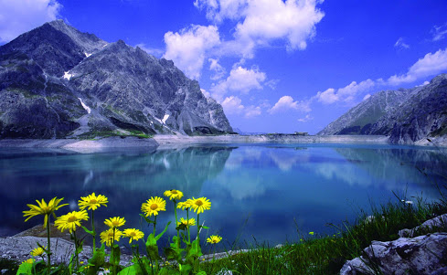

Calmness

What is calmness? What is being in the state of calmness? I think I never understood the meaning of calmness nor experienced the state completely.

Well , What's calmness then? I feel it's the spirit of understanding the situation and treating it in a positive way. A lot of confusions and misunderstandings can be avoided if we remain calm.

Remaining calm also means not to react and remain quiet for some time. My friend often tells me to respond and not to react to a situation. I feel that's a quite true statement. Often I regret for reacting.

The best solution to remain calm is to do self analysis, find out the merits and demerits of the thing being discussed and then to speak out. If there is no time at all, then remaining quiet for a few minutes is the best possible way out of it.

Staying calm is a way of relaxing and watching over everything from a third person's point of view. I think I can achieve a great sense of happiness and contentment by remaining calm :-)
